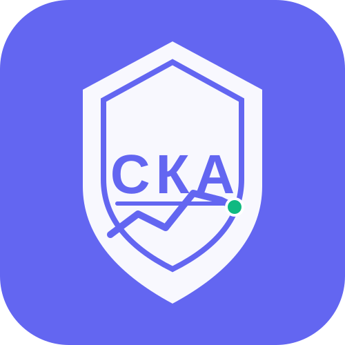
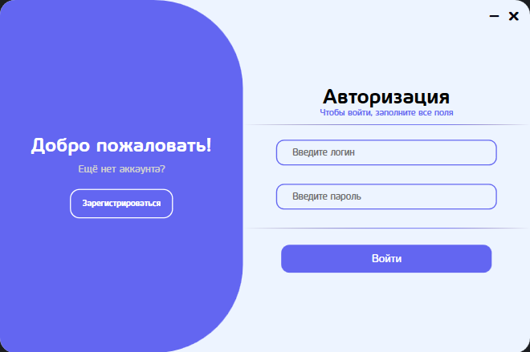
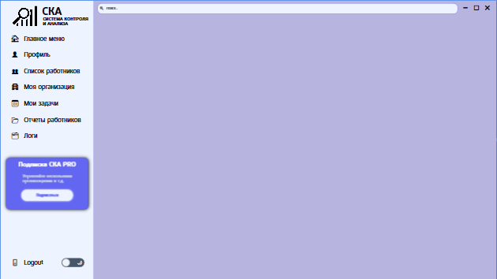
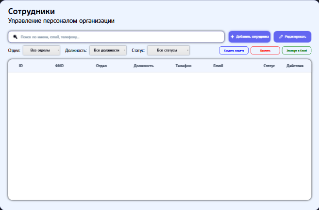
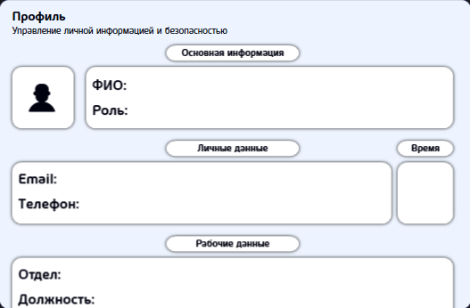
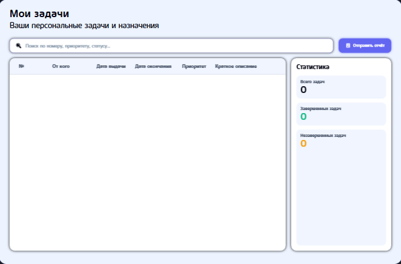
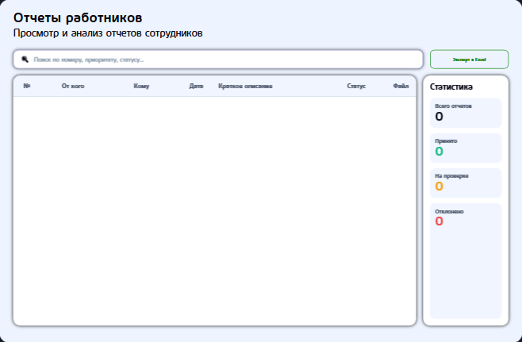

<div align="center">
  
  <h1>СКА — Система Контроля и Анализа</h1>
  <p>
    <strong>Умное решение для управления персоналом, задачами и отчётностью в организациях</strong>
  </p>

  <p>
    
    
    
    
  </p>
</div>

---

## 📋 Оглавление

- [Возможности](#-возможности)
- [Технологии](#-технологии)
- [Скриншоты](#-скриншоты)
- [Установка и запуск](#-установка-и-запуск)
- [Структура проекта](#-структура-проекта)
- [Настройка базы данных](#-настройка-базы-данных)
- [Безопасность](#-безопасность)
- [Дорожная карта](#-дорожная-карта)
- [Лицензия](#-лицензия)

---

## 🚀 Возможности

### 👥 Управление сотрудниками
- Просмотр, добавление, редактирование и удаление сотрудников
- Привязка к отделам и должностям
- Отслеживание статусов: **Работает**, **В отпуске**, **Уволен**
- Поиск и фильтрация по ФИО, телефону, email, отделу, должности и статусу
- Массовое удаление и создание задач для выбранных сотрудников

### ✅ Задачи и поручения
- Назначение задач конкретным сотрудникам с указанием приоритета и срока
- Отслеживание статусов: **Новая**, **В работе**, **Завершена**
- Персональная страница «Мои задачи» для каждого сотрудника

### 📄 Отчёты работников
- Отправка отчётов с возможностью прикрепления файлов (Word, Excel и др.)
- Просмотр входящих отчётов с фильтрацией и поиском
- Принятие / отклонение отчётов прямо в таблице

### 🏢 Моя организация
- Редактирование контактной информации организации
- Управление отделами и должностями (добавление, удаление)
- Живая статистика по сотрудникам, отделам и должностям

### 📜 Логи системы
- Запись всех ключевых событий (авторизация, добавление/удаление сотрудников и т.д.)
- Удобная фильтрация по типу события и дате
- Автоматическое логирование без вмешательства пользователя

### 👤 Профиль пользователя
- Просмотр и редактирование личных данных (ФИО, Email, Телефон)
- Отображение должности и отдела
- Смена пароля (в разработке)

### 🎨 Темы оформления
- Светлая и тёмная темы с анимированным переключателем
- Все стили вынесены в отдельные XAML‑словари
- Модульная система стилей (каждый тип кнопки в своём файле)

### 📊 Экспорт данных
- Экспорт списка сотрудников и отчётов в **Excel**
- Библиотека ClosedXML для быстрой генерации файлов

### 🔒 Система ролей
- **Owner** — полный доступ ко всем функциям
- **Admin** — управление сотрудниками, отделами, задачами
- **User** — видит свои задачи и отчёты, не может редактировать чужие данные

---

## 🛠️ Технологии

| Компонент          | Технология                                      |
| ------------------ | ----------------------------------------------- |
| **Язык**           | C# 10.0                                         |
| **Платформа**      | .NET Framework 4.8 / .NET 6+ (WPF)              |
| **Интерфейс**      | WPF (XAML), кастомные стили и ControlTemplate   |
| **База данных**    | MySQL (основная), поддержка SQLite встроенной БД |
| **ORM / доступ**   | MySqlConnector (или MySql.Data)                 |
| **Экспорт**        | ClosedXML                                       |
| **Логирование**    | Собственный класс `Logger`                      |
| **Управление темами** | Динамическая подгрузка ResourceDictionary     |
| **Контроль версий** | Git, GitHub                                     |

---

## 🖼️ Скриншоты

> ⚠️ *Добавьте реальные скриншоты вашего приложения в папку `Screenshots` и обновите пути ниже.*

| Окно авторизации | Главное меню |
|------------------|--------------|
|  |  |

| Список сотрудников | Профиль |
|-------------------|---------|
|  |  |

| Мои задачи | Отчёты |
|------------|--------|
|  |  |

---

## 📦 Установка и запуск

### Предварительные требования

- **Windows 10 / 11** (x64)
- **.NET Framework 4.8** или **.NET Desktop Runtime 6.0+**
- **MySQL Server 8.0+** (если используется удалённая БД)
- **Visual Studio 2022** (для сборки из исходников)

### Быстрый старт

1. **Клонируйте репозиторий**
   ```bash
   git clone https://github.com/yourusername/SKAProject.git
